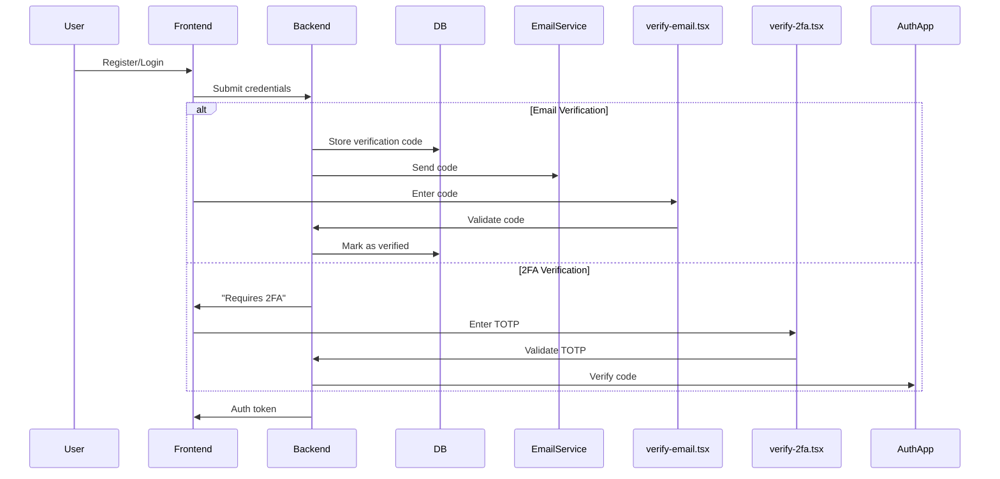

Here's a clear explanation of the functionalities for `verify-email.tsx` and `verify-2fa.tsx` in authentication flow:

---

### **1. `verify-email.tsx` - Email Verification Page**
**Purpose**:  
Handles email address verification after registration.

**Typical Flow**:
1. User registers → receives email with verification code
2. User enters code → system verifies and activates account

**Key Features**:
```tsx
// Example implementation
export default function VerifyEmail() {
  const [code, setCode] = useState('');
  const { email } = useLocation().state || {};

  const handleSubmit = async () => {
    await api.post('/verify-email', { code, email });
    // Redirect to login with success message
  };

  return (
    <div>
      <h1>Verify Your Email</h1>
      <input 
        value={code}
        onChange={(e) => setCode(e.target.value)}
        placeholder="Enter 6-digit code"
      />
      <button onClick={handleSubmit}>Verify</button>
    </div>
  );
}
```

**Backend Requirements**:
- Stores verification codes in DB
- Validates code expiration (typically 15-30 mins)
- Updates `user.isVerified` flag

---

### **2. `verify-2fa.tsx` - Two-Factor Authentication Page**
**Purpose**:  
Handles second authentication factor (e.g., TOTP codes from authenticator apps).

**Typical Flow**:
1. User logs in with email/password
2. If 2FA enabled → redirect to this page
3. User enters 6-digit code → gains access

**Key Features**:
```tsx
// Example implementation
export default function Verify2FA() {
  const [totpCode, setTotpCode] = useState('');
  const { tempToken } = useLocation().state || {};

  const handleSubmit = async () => {
    await api.post('/verify-2fa', { 
      code: totpCode,
      tempToken 
    });
    // On success: Redirect to dashboard
  };

  return (
    <div>
      <h1>Two-Factor Authentication</h1>
      <input
        value={totpCode}
        onChange={(e) => setTotpCode(e.target.value)}
        placeholder="Enter authenticator code"
      />
      <button onClick={handleSubmit}>Verify</button>
    </div>
  );
}
```

**Backend Requirements**:
- Validates TOTP codes against stored secret
- Uses libraries like `speakeasy` or `otplib`
- Issues final JWT after successful verification

---

### **Key Differences**

| Feature               | `verify-email.tsx`               | `verify-2fa.tsx`                 |
|-----------------------|----------------------------------|----------------------------------|
| **Trigger**           | After registration               | During login (if 2FA enabled)    |
| **Code Type**         | One-time use (stored in DB)      | Time-based (TOTP from app)       |
| **Persistence**       | Disabled after verification      | Required every login             |
| **Security Level**    | Basic account activation         | Enhanced security layer          |

---

### **When to Use Each**

1. **Email Verification** (`verify-email.tsx`)  
   - Required for all new registrations  
   - Ensures valid email ownership  
   - Prevents fake/spam accounts  

2. **2FA Verification** (`verify-2fa.tsx`)  
   - Optional for security-conscious users  
   - Protects against password breaches  
   - Recommended for admin accounts  

---

### **Implementation Tips**

1. For email verification:
   ```ts
   // Backend example
   router.post('/verify-email', async (req, res) => {
     const user = await db.user.findFirst({
       where: { 
         email: req.body.email,
         verificationCode: req.body.code 
       }
     });
     if (!user) throw new Error("Invalid code");
     
     await db.user.update({
       where: { id: user.id },
       data: { isVerified: true }
     });
   });
   ```

2. For 2FA verification:
   ```ts
   import { authenticator } from 'otplib';
   
   router.post('/verify-2fa', async (req, res) => {
     const user = await db.user.findFirst({
       where: { twoFactorSecret: { not: null } }
     });
     
     if (!authenticator.check(req.body.code, user.twoFactorSecret)) {
       throw new Error("Invalid 2FA code");
     }
     
     // Issue final JWT
   });
   ```

---

### **Visual Flow**


Both components are crucial for building secure authentication systems, serving different but complementary purposes.
